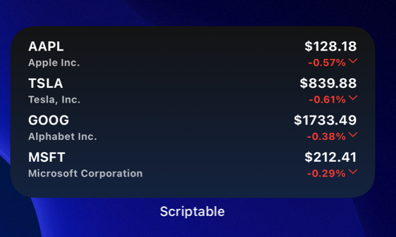
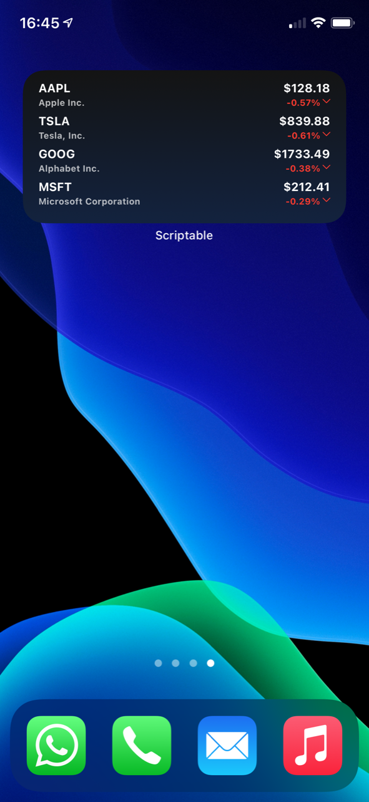
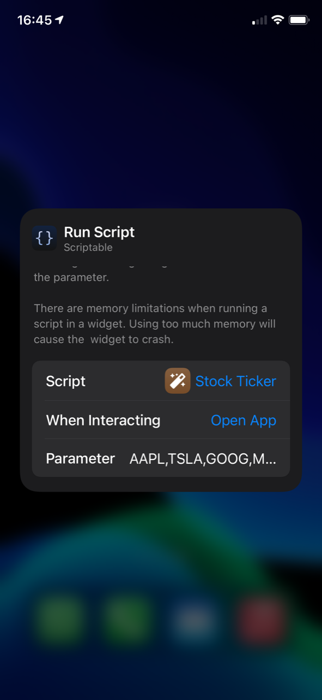

# stock-widget.js
A Scriptable widget that shows stock prices and the percentual change from yahoo finance api. Also works with cryptocurrencies.





 

<p>
  <a href="#setup">Setup</a> •
  <a href="#usage">Usage</a> •
  <a href="#links">Links</a> •
  <a href="#contribution">Contribution</a> •
</p>


## Setup

1. (if not done yet) Download the scriptable app form AppStore: https://apps.apple.com/de/app/scriptable/id1405459188
2. In Scriptable create a new script
3. Copy the code from file stock-widget.js: https://github.com/wickenico/stock-widget.js/blob/master/stock-widget.js
4. Create a new widget on homescreen and select this script in scriptable



## Usage

You can select your stock symbols in 2 different ways:

1. You select the stocks which you want to display in the app through the parameter field. Separate them with ","


2. You can code the stocks directly in the code in function **getStockData()**:
```javascript
  if(args.widgetParameter == null) {
    // EDIT: Insert your symbols between the quotation marks 
    stocks = ["AAPL", "22UA.DE", "GC=F", "BTC-USD"];
  } else {
    stocks = args.widgetParameter.split(",");
  }
```

## Links
Yahoo Finance: https://finance.yahoo.com/


## Contribution

If you have any ideas for extensions or changes just let me know.

